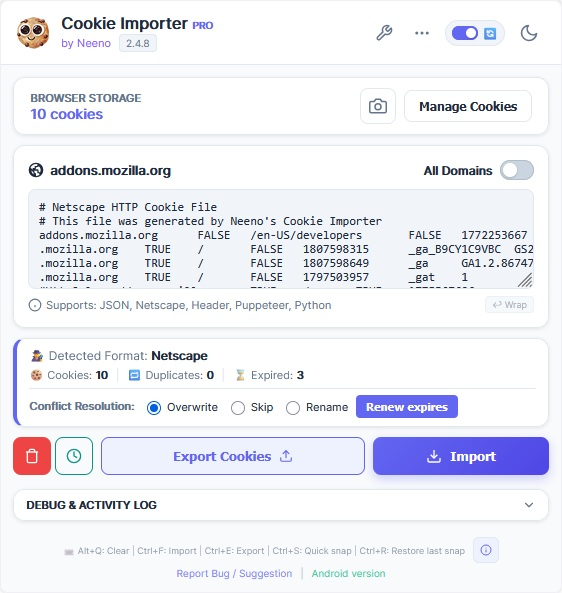

# Neeno's Cookie Importer

**The definitive session management suite for developers to master browser cookies with precision, speed, and unlimited scale.**

**Neeno's Cookie Importer** transforms the complex workflow of managing session data into a seamless experience. Powered by a brand new IndexedDB architecture, v2.4.9 evolves into a heavyweight toolkit: allowing you to **Snapshot** unlimited sessions for later use, **Lock** critical cookies against accidental deletion, and **Edit** advanced attributes directly from a non-blocking UI.

Whether you are debugging intricate authentication flows, migrating user sessions between profiles, or configuring test environments, this extension provides a robust interface to handle Netscape, JSON, **Puppeteer, and Python** formats without the hassle.

#### **🚀 Unlimited Session Snapshots & Inspector**

Never lose a session state again, and never worry about storage quotas.

* **IndexedDB Power:** Save practically unlimited session profiles. Our new lazy-loading architecture ensures the UI remains lightning-fast, fetching heavy cookie data only when you interact with a snapshot.
* **Create & Restore on Demand:** Instantly back up your current browser cookies into a named snapshot, or swap between saved accounts effortlessly.
* **Inspect Before Restore:** View the contents of any snapshot without applying it. The detailed view groups cookies by domain, letting you verify the session contains the correct data.
* **Memory-Safe Exports:** Export your entire snapshot library to the clipboard. The new streaming cursor prevents memory spikes even when handling massive datasets.

#### **🧹 Advanced Management & Deep Cleaning**

* **The "Danger Zone" Deep Clean:** Gain granular control over your browser's data. Selectively wipe IndexedDB, Local/Session Storage, Service Workers, Cache, and Form Data all from one compact grid—while keeping your locked cookies perfectly intact.
* **Advanced Visual Filters:** Toggle, filter, and modify **Secure**, **HttpOnly**, and **SameSite** flags instantly using the new compact filter pills in both the Manage and Import modals.
* **Cookie Locking:** Mark specific cookies as "Locked." These protected cookies will persist even when you hit clear, ensuring you stay logged in to essential tools while wiping the rest of your session.
* **Revive Expired Cookies:** A dedicated tool automatically detects expired cookies in your clipboard and allows you to renew their expiration dates with preset or custom durations, saving your preferences for future sessions.

#### **🔄 Universal Export & Conversion**

Turn your browser cookies into code instantly. The Export Suite allows you to convert your active cookies into any format you need for development:

* **JSON & Netscape:** Standard formats for archiving or using with `wget` and `curl`.
* **Python & Puppeteer:** Generate ready-to-paste code dictionaries for your automation scripts, now featuring upgraded parsing that flawlessly handles falsy values and escaped single quotes.
* **Header String:** Get a raw `name=value;` string for quick API testing.
* **CSV:** Export cookie data to a spreadsheet file or clipboard for auditing and documentation.

#### **⚡ Power User Workflows & Shortcuts**

Keep your hands on the keyboard with our expanded shortcut integration:

* **`Alt+Q`:** Instantly clear all unprotected cookies.
* **`Ctrl+S`:** Quick save your current session into a snapshot.
* **`Ctrl+R`:** Instantly restore your most recent snapshot.
* **Expanded Shortcuts Menu:** Click the list icon in the footer to access a complete guide to all keyboard bindings.
* **Configurable Logging:** Keep your built-in Activity Log clean by setting custom limits on the maximum number of debug entries.

#### **🛡️ Core Security & Compatibility Features**

* **Smart Store Support:** Fully compatible with **Incognito mode** and **Firefox Containers**, ensuring cookies are applied to the correct isolated storage ID.
* **Smart Domain Matching:** Intelligent logic automatically resolves "www" vs non-www conflicts, ensuring cookies are applied correctly even if the domain structure varies.
* **Conflict Resolution:** Choose exactly how to handle duplicate cookies during import—**Overwrite**, **Skip**, or **Rename**—to prevent accidental data loss.
* **Security Compliance:** Built-in logic automatically enforces browser security standards by validating `__Host-` and `__Secure-` prefixes.
* **Theme Adaptive:** A polished, modern interface that syncs perfectly with your system’s Light or Dark mode.
